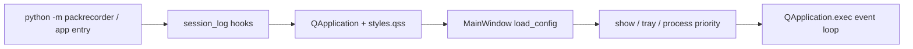
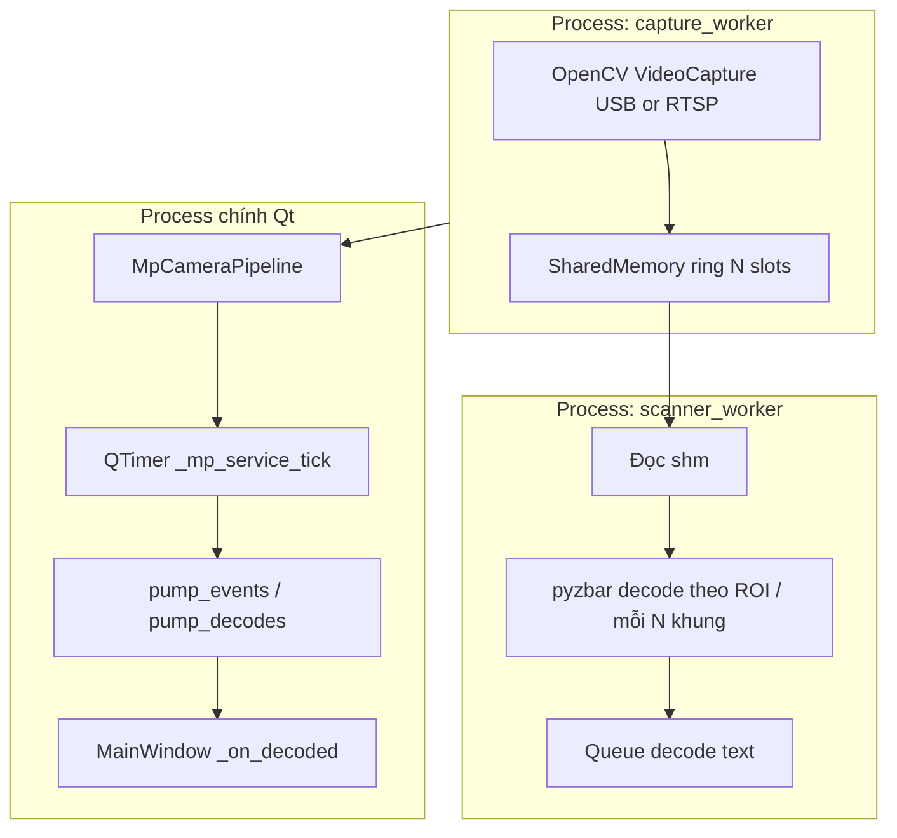
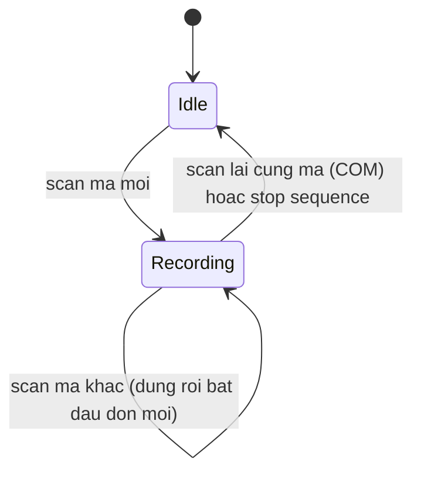
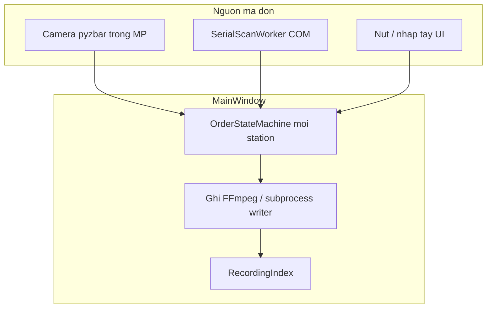

# Pack Recorder — Kiến trúc và luồng hoạt động (hiện tại)

Tài liệu mô tả cấu trúc mã nguồn và các luồng chính của ứng dụng **Pack Recorder** (Windows, PySide6 + OpenCV + FFmpeg). Nội dung phản ánh trạng thái repo tại thời điểm viết; khi refactor, cần cập nhật file này cùng thay đổi.

---

## 1. Tổng quan

- **Mục đích:** Quay video đóng gói theo **mã đơn** (barcode / nhập tay), lưu file có cấu trúc, tùy chọn đồng bộ ổ dự phòng, heartbeat, tìm kiếm video đã ghi.
- **Tiến trình chính:** Một **QApplication** (GUI Qt), không phải daemon headless thuần; có thể **thu vào khay hệ thống** nhưng vẫn chạy Qt event loop.
- **Nguồn hình:** Webcam USB (index 0–9), hoặc **RTSP** (URL), đọc qua OpenCV (`cv2.VideoCapture`).
- **Nguồn mã đơn:**
  - **Camera + pyzbar** (trong worker / tiến trình con).
  - **Cổng COM** (máy quét USB–Serial / VCP) qua `pyserial`.
  - **Nhập tay** trong UI (nút «Bắt đầu ghi»); chế độ **COM-only** có thể chặn gửi bằng phím Enter để tránh wedge.

---

## 2. Cấu trúc thư mục (gói `packrecorder`)

| Khu vực | Vai trò |
|--------|---------|
| [`app.py`](../src/packrecorder/app.py) | Điểm vào GUI: QApplication, stylesheet, `MainWindow`, khay/tray. |
| [`__main__.py`](../src/packrecorder/__main__.py) | Entry `python -m packrecorder`. |
| [`config.py`](../src/packrecorder/config.py) | `AppConfig`, `StationConfig`, load/save JSON, normalize, schema version. |
| [`ui/main_window.py`](../src/packrecorder/ui/main_window.py) | Điều phối trung tâm: worker, pipeline, ghi hình, cài đặt. |
| [`ui/dual_station_widget.py`](../src/packrecorder/ui/dual_station_widget.py) | UI 2 quầy: camera, RTSP, COM, ROI preview, mã đơn. |
| [`ui/settings_dialog.py`](../src/packrecorder/ui/settings_dialog.py) | Hộp thoại cài đặt toàn cục. |
| [`ui/recording_search_dialog.py`](../src/packrecorder/ui/recording_search_dialog.py) | Tìm kiếm video / index. |
| [`ipc/pipeline.py`](../src/packrecorder/ipc/pipeline.py) | `MpCameraPipeline`: process capture + process scanner + SharedMemory. |
| [`ipc/capture_worker.py`](../src/packrecorder/ipc/capture_worker.py) | Tiến trình đọc camera → ring buffer shm. |
| [`ipc/scanner_worker.py`](../src/packrecorder/ipc/scanner_worker.py) | Tiến trình pyzbar trên khung từ shm (chỉ decode khi seq khớp `latest_seq`). |
| [`ipc/capture_backoff.py`](../src/packrecorder/ipc/capture_backoff.py) | Backoff khi `cap.read()` thất bại liên tiếp. |
| [`shm_cleanup.py`](../src/packrecorder/shm_cleanup.py) | Dọn shm orphan tên `packrecorder_pr_*` (POSIX, lúc startup). |
| [`ipc/encode_writer_worker.py`](../src/packrecorder/ipc/encode_writer_worker.py) | Writer subprocess (đọc shm → FFmpeg). |
| [`scan_worker.py`](../src/packrecorder/scan_worker.py) | Luồng **trong process** khi tắt MP (`PACKRECORDER_DISABLE_MP`). |
| [`serial_scan_worker.py`](../src/packrecorder/serial_scan_worker.py) | QThread đọc COM; reader thread + queue có giới hạn. |
| [`ffmpeg_pipe_recorder.py`](../src/packrecorder/ffmpeg_pipe_recorder.py) | Ghi video qua pipe tới FFmpeg (in-process). |
| [`recording_index.py`](../src/packrecorder/recording_index.py) | SQLite index metadata video. |
| [`sync_worker.py`](../src/packrecorder/sync_worker.py) | Đồng bộ backup. |
| [`status_publish.py`](../src/packrecorder/status_publish.py) | Ghi JSON heartbeat / trạng thái. |
| [`order_state.py`](../src/packrecorder/order_state.py) | State machine: quét bắt đầu/dừng ghi. |
| [`opencv_video.py`](../src/packrecorder/opencv_video.py) | Mở capture USB / RTSP (timeout env). |
| [`serial_ports.py`](../src/packrecorder/serial_ports.py) | Liệt kê COM, nhãn VID:PID, `choose_serial_port`. |

Các module phụ: `telegram_notify`, `duplicate`, `retention`, `paths`, `session_log`, v.v.

---

## 3. Khởi động ứng dụng

- [`app.run_app()`](../src/packrecorder/app.py): reset log phiên, cài hook lỗi, load QSS, tạo `MainWindow`, tùy chọn `low_process_priority`, `apply_start_in_tray`, `exec()`.
- Config mặc định: `%LOCALAPPDATA%\PackRecorder\config.json` (xem `default_config_path()`).

---

## 4. Chế độ đa camera (`multi_camera_mode`)

| Giá trị | Hành vi UI / logic |
|--------|---------------------|
| `single` | Một camera, một nhãn packer (legacy). |
| `pip` | Hai camera composite PIP, một luồng decode theo `pip_decode_camera_index`. |
| `stations` | **Hai quầy** (`DualStationWidget`): mỗi quầy có camera ghi, ROI, tùy RTSP, COM hoặc camera đọc mã. |

`MainWindow._effective_stations()` map config → danh sách `StationConfig` cho state machine và worker.

---

## 5. Luồng camera (mặc định: multiprocessing)

Khi `use_multiprocessing_camera_pipeline=True` (mặc định; có thể tắt bằng env `PACKRECORDER_DISABLE_MP=1`):

- **`MpCameraPipeline`** ([`ipc/pipeline.py`](../src/packrecorder/ipc/pipeline.py)): spawn **capture** trước; khi có shm, spawn **scanner** nếu `decode_enabled`.
- **UI thread** không đọc camera trực tiếp; dùng timer gọi `pump_decodes()` / copy preview từ shm.
- **Preview** đa quầy: `MainWindow._preview_targets` map `camera_index` → danh sách cột; `_on_worker_preview` / `_flush_pending_station_previews` đẩy BGR vào `RoiPreviewLabel`.

**Sơ đồ tách luồng:** để không nhầm **payload** (pixel trong shm, chuỗi sau decode, file sau ghi) với **điều khiển** (spawn worker, lệnh start/stop ghi + mã đơn, `QTimer` → `status.json`), xem hai flowchart song song trong [`docs/software-operation-mindmap.md`](software-operation-mindmap.md) (mục *Pipeline: tách mặt phẳng dữ liệu và mặt phẳng điều khiển*).

**Fallback in-process:** `ScanWorker` ([`scan_worker.py`](../src/packrecorder/scan_worker.py)) — tín hiệu Qt `decoded`, `frame_ready`, dùng khi MP tắt.

---

## 6. Ghi video (FFmpeg)

- **`FFmpegPipeRecorder`:** pipe raw BGR vào FFmpeg (in-process).
- **Đa quầy + MP:** có thể dùng **`SubprocessRecordingHandle`** + [`encode_writer_worker`](../src/packrecorder/ipc/encode_writer_worker.py) đọc đúng vùng shm/ROI và encode (giảm tải UI).
- **Pacing:** `_recording_emit_tick` đồng bộ FPS đích với đồng hồ tường; burn-in text qua [`video_overlay.py`](../src/packrecorder/video_overlay.py).
- **Đường dẫn output:** [`paths.build_output_path`](../src/packrecorder/paths.py) + [`storage_resolver.choose_write_root`](../src/packrecorder/storage_resolver.py) (primary / backup).

---

## 7. Luồng mã đơn → ghi / dừng

- **`OrderStateMachine`** ([`order_state.py`](../src/packrecorder/order_state.py)):
  - IDLE → quét mã mới → **bắt đầu ghi**.
  - Đang RECORDING: tùy `same_scan_stops_recording` (COM: quét lại cùng mã → dừng); camera decode: quy tắc khác (đổi mã mới mới chuyển).
- **Nguồn gọi `_handle_decode_station`:**
  - `_on_decoded` (camera/pyzbar),
  - `_on_serial_decoded` (COM),
  - `_on_manual_order_submitted` (nút nhập tay),
  - PIP/single có nhánh riêng.

**Trùng đơn trong ngày:** [`duplicate.is_duplicate_order`](../src/packrecorder/duplicate.py) → không ghi, có thể Telegram ([`telegram_notify`](../src/packrecorder/telegram_notify.py)).

---

## 8. Máy quét cổng COM (serial)

[`SerialScanWorker`](../src/packrecorder/serial_scan_worker.py) (QThread):

- Thread **`_reader_loop`**: `serial.Serial.readline()` → chuỗi UTF-8, debounce trùng liên tiếp; `SerialException` → đóng port, backoff, mở lại (giới hạn lần thử).
- **Queue giới hạn** (`SERIAL_SCAN_QUEUE_MAX`): `put_scan_line_drop_oldest` — đầy thì bỏ mã cũ, tránh nghẽn UI; log throttle khi drop.
- Luồng QThread chính `run()`: `queue.get` → `line_decoded.emit(station_id, text)`.
- **MainWindow** nối signal → `_on_serial_decoded` (QueuedConnection), cập nhật ô mã (tuỳ chế độ), debounce submit trùng ngắn.

**Cấu hình:** `StationConfig.scanner_serial_port`, `scanner_serial_baud`, `scanner_usb_vid` / `scanner_usb_pid` (hỗ trợ auto chọn cổng trong UI), `AppConfig.scanner_com_only`.

---

## 9. UI chính (`MainWindow` + `DualStationWidget`)

- **Thanh công cụ:** độ phân giải ghi, ghim «Luôn trên cùng».
- **Cột quầy:** tên máy, USB vs RTSP, combo camera / URL, ROI trên `RoiPreviewLabel`, combo COM, ô «Mã đơn», banner/overlay khi ghi.
- **Cài đặt:** `SettingsDialog` — đổi mode camera, âm thanh, khay, HA, retention, v.v.; lưu lại → `normalize_config` → restart worker.
- **Tìm kiếm:** `RecordingSearchDialog` — truy vấn SQLite index, lưu bản sao, xóa bản ghi.

---

## 10. Dữ liệu nền: index, đồng bộ, heartbeat

- **`RecordingIndex`:** SQLite (đường dẫn theo config), insert sau khi ghi xong (`_finalize_saved_recording`).
- **`BackupSyncWorker`:** khoảng thời gian `sync_worker_interval_ms`, đồng bộ file/metadata sang backup.
- **`publish_status_json`:** ghi file trạng thái (primary/backup), phục vụ monitor «máy phụ» / văn phòng.
- **`office_heartbeat_poll`:** đọc JSON remote (nếu cấu hình) → indicator trên status bar.

---

## 11. Độ tin cậy kho (watchdog, cooldown, worker MP)

- **`OrderStateMachine` — `order_transition_cooldown_s`:** sau mỗi lần chuyển trạng thái ghi (bắt đầu/dừng/switch), trong cửa sổ cooldown bỏ qua thêm tín hiệu quét trùng (giảm race COM/camera). `0` = tắt (mặc định).
- **Heartbeat MP:** [`ipc/pipeline.py`](../src/packrecorder/ipc/pipeline.py) giữ `multiprocessing.Value` wall-clock cho capture và scanner; worker cập nhật mỗi vòng lặp. **`ipc_worker_stale_seconds`** (`AppConfig`, `0` = tắt): nếu nhịp quá cũ, `MainWindow._mp_service_tick` log + dừng pipeline + `restart` worker (cooldown 30s/camera).
- **Lỗi worker:** capture/scanner gửi `("worker_error", camera_index, traceback)` → `_on_mp_worker_error` (log + status 30s). Lỗi mở camera sớm vẫn dùng `capture_failed` khi thích hợp.
- **Capture — đọc khung thất bại:** [`ipc/capture_backoff.py`](../src/packrecorder/ipc/capture_backoff.py) backoff 1→2→4→8→16s; sau `CAPTURE_MAX_CONSECUTIVE_READ_FAILS` lần liên tiếp → `capture_failed` và thoát process.
- **COM reconnect:** [`serial_scan_worker.py`](../src/packrecorder/serial_scan_worker.py) trên `SerialException` đóng port, backoff, mở lại; quá `MAX_SERIAL_TRANSPORT_FAILURES` → `failed.emit`.
- **SharedMemory:** tên có tiền tố `packrecorder_pr_` ([`frame_ring.py`](../src/packrecorder/ipc/frame_ring.py)). Trên POSIX, [`shm_cleanup.py`](../src/packrecorder/shm_cleanup.py) chạy lúc startup (`app.run_app`) để `unlink` orphan trong `/dev/shm`.
- **`atexit`:** đăng ký `MainWindow.run_atexit_cleanup` để gọi `_shutdown_application` khi process thoát bất thường (best-effort).
- **HID POS:** máy quét HID qua thư viện HID + VID/PID — xem `hid_pos_scan_worker.py`, `hid_scanner_discovery.py`; dependency PyPI **`hidapi`** (import `hid`, wheel Windows kèm binary).

---

## 12. Cấu hình và phiên bản schema

- File JSON: `AppConfig.schema_version` (tăng khi thêm field; `load_config` bump version cũ).
- `normalize_config()` đảm bảo giá trị hợp lệ (FPS, ROI, baud, VID/PID hex, v.v.).
- Biến môi trường quan trọng (không đầy đủ): `PACKRECORDER_DISABLE_MP`, `PACKRECORDER_RTSP_*`, `OPENCV_FFMPEG_RTSP_TRANSPORT`.

---

## 13. Sơ đồ tổng hợp (đa quầy + MP + COM)

---

## 14. File chạy / triển khai

- `run_packrecorder.bat`, `run_packrecorder_console.bat`, `run_packrecorder_no_mp.bat`: khởi chạy với biến môi trường / console tùy chỉnh.
- Log phiên: `run_errors.log` (và gợi ý trong stderr khi start); `debug-*.log` thường gitignore.

---

## 15. Ghi chú bảo trì

- Thay đổi **hợp đồng shm / queue** giữa capture ↔ scanner ↔ writer cần test trên Windows spawn.
- **Hai quầy không được trùng cổng COM** (validation UI).
- **Camera decode vs COM:** logic `station_for_decode_camera` / `camera_should_decode_on_index` tránh gán nhầm mã khi một quầy dùng COM nhưng camera quầy kia vẫn decode.

---

*Tài liệu này được tạo để onboard và review kiến trúc; chỉnh sửa khi có thay đổi luồng lớn.*
