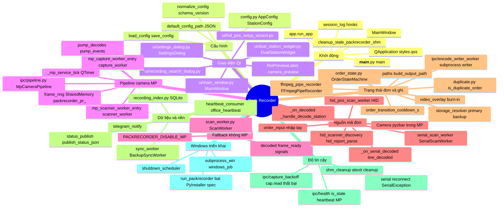
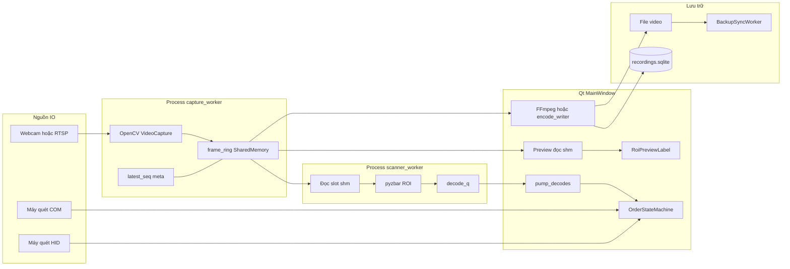
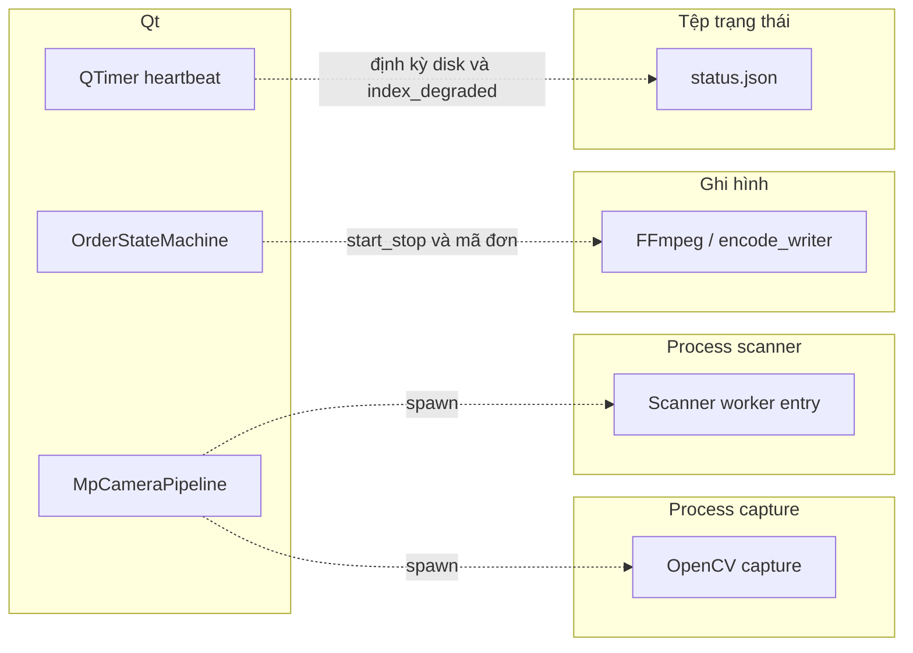

# Mind map — cách phần mềm Pack Recorder hoạt động

Tài liệu tóm tắt **luồng và module**: mind map (tổng quan) + **hai flowchart** (mặt phẳng dữ liệu / mặt phẳng điều khiển) + bảng **tầng kiến trúc** + **mô hình dữ liệu**, **nút thắt hiệu năng**, **đồng bộ Qt**. Chi tiết luồng: [`architecture-and-flow.md`](architecture-and-flow.md).

---

## Mind map tổng thể

---

## Pipeline: tách **mặt phẳng dữ liệu** và **mặt phẳng điều khiển**

Mind map không thể hiện chiều luân chuyển; với pipeline có camera/MP cần **phân biệt**:

- **Nét liền (`-->`):** payload — pixel/BGR trong shm, chuỗi mã sau decode, file/metadata sau khi ghi.
- **Nét đứt (`-.->`):** điều khiển — spawn tiến trình, lệnh bắt đầu/dừng ghi + mã đơn (không có hình), nhịp định kỳ ghi `status.json`.

### A — Mặt phẳng dữ liệu (pixel, text mã, file)

**Điểm neo mã:** `REC` nhận **khung hình** từ shm (subprocess writer / pipe gắn pipeline), không nhận pixel từ `OrderStateMachine`. Preview: `_refresh_mp_recording_and_preview` đọc shm → `_on_worker_preview` → `DualStationWidget` / `RoiPreviewLabel`.

### B — Mặt phẳng điều khiển và vận hành

**Điểm neo mã:** `publish_status_json` được gọi từ `_on_heartbeat_timer` (`MainWindow`), không phải từ đường ghi file trực tiếp. `attach_params_for_writer` truyền tham số shm cho writer subprocess.

---

## Hiệu năng & nút thắt (đối chiếu mã)

- **Scanner / pyzbar:** `scanner_worker` chỉ decode khi `seq` khớp `latest_seq` và `seq > seen_seq`, bỏ qua khung đã lỗi thời — giảm rủi ro “đuổi” hết backlog khung cũ và mã decode trễ hàng giây. Thông báo `(seq, slot, ...)` qua `meta_queue` từ capture; xem [`scanner_worker.py`](../src/packrecorder/ipc/scanner_worker.py).
- **Khóa shm / đọc song song:** nhiều bên đọc cùng ring (capture ghi, scanner decode, UI preview, writer ghi file) — dùng lock + copy nhanh (ví dụ `.copy()` slice trước pyzbar). Đây là tradeoff độ trễ vs an toàn; nếu đo được contention mới tối ưu thêm — xem [`frame_ring.py`](../src/packrecorder/ipc/frame_ring.py), [`pipeline.py`](../src/packrecorder/ipc/pipeline.py).
- **FFmpeg in-process:** [`ffmpeg_pipe_recorder.py`](../src/packrecorder/ffmpeg_pipe_recorder.py) ghi qua pipe; nếu `write` block (ổ đầy/chậm), luồng gọi có thể bị kẹt — **ưu tiên** đường subprocess writer đọc shm (`encode_writer_worker`) khi cấu hình đa quầy/MP để tách tải khỏi UI.

---

## Đồng bộ Qt và `OrderStateMachine`

- **COM / HID → UI:** `line_decoded` nối vào slot `MainWindow` bằng **`Qt.ConnectionType.QueuedConnection`** (xem chỗ `connect` trong [`main_window.py`](../src/packrecorder/ui/main_window.py)), để tín hiệu từ `QThread` worker đưa về **luồng Qt chính** trước khi chạm logic đơn.
- **`OrderStateMachine`:** nên chỉ cập nhật từ code chạy trên luồng UI sau khi đã qua slot/signal (hoặc `QTimer`/`singleShot` trên cùng thread). Thêm đường gọi trực tiếp từ thread khác vào `SM` sẽ dễ gây race — tránh khi mở rộng tính năng.

---

## Tra cứu nhanh — theo **tầng kiến trúc**

| Tầng | File | Hàm / symbol đáng nhớ |
|------|------|------------------------|
| **UI / điều phối** | `__main__.py` | `main()` — set biến môi trường OpenCV trước khi import app |
| **UI / điều phối** | `app.py` | `run_app()` — log, `cleanup_stale_packrecorder_shm`, tạo `MainWindow`, tray |
| **UI / điều phối** | `ui/main_window.py` | `_mp_service_tick`, `_on_decoded`, `_on_serial_decoded`, `_handle_decode_station`, `_finalize_saved_recording` |
| **UI / điều phối** | `ui/dual_station_widget.py`, `ui/settings_dialog.py`, … | Widget cài đặt, hai quầy, ROI preview |
| **IO / thiết bị** | `opencv_video.py`, `camera_probe.py` | Mở USB / RTSP, probe camera |
| **IO / thiết bị** | `serial_scan_worker.py` | `SerialScanWorker`, `_reader_loop`, `line_decoded` |
| **IO / thiết bị** | `hid_pos_scan_worker.py`, `hid_scanner_discovery.py` | Quét HID theo VID/PID |
| **IPC / lõi xử lý** | `ipc/pipeline.py` | `MpCameraPipeline.start`, `attach_params_for_writer`, `pump_decodes` |
| **IPC / lõi xử lý** | `ipc/capture_worker.py` | `mp_capture_worker_entry` |
| **IPC / lõi xử lý** | `ipc/scanner_worker.py` | `mp_scanner_worker_entry` |
| **IPC / lõi xử lý** | `ipc/frame_ring.py` | `attach_ring_shm`, `ndarray_slot` — vùng đệm khung giữa process |
| **IPC / lõi xử lý** | `ipc/encode_writer_worker.py` | Writer subprocess đọc shm → FFmpeg |
| **Domain / luật nghiệp vụ** | `order_state.py` | `OrderStateMachine`, `on_scan` → `ScanResult` |
| **Domain / luật nghiệp vụ** | `duplicate.py` | `is_duplicate_order` |
| **Domain / luật nghiệp vụ** | `config.py` | `AppConfig`, `StationConfig` — JSON trên đĩa |
| **Ghi hình / mã hóa** | `ffmpeg_pipe_recorder.py`, `video_overlay.py` | `FFmpegPipeRecorder`, burn-in text |
| **Lưu trữ & vận hành** | `paths.py`, `storage_resolver.py` | `build_output_path`, chọn primary/backup |
| **Lưu trữ & vận hành** | `recording_index.py` | `RecordingIndex`, bảng `recordings` (SQLite) |
| **Lưu trữ & vận hành** | `status_publish.py` | `build_status_payload`, `publish_status_json` |
| **Lưu trữ & vận hành** | `sync_worker.py`, `heartbeat_consumer.py` | Đồng bộ backup, đọc heartbeat văn phòng |

---

## Mô hình dữ liệu & payload giữa các phần (bổ sung ngữ cảnh)

Tài liệu mind map thường nhấn **worker / pipeline**; dưới đây là **định dạng trạng thái** và **dữ liệu luân chuyển** chính (tra cứu nhanh trong mã).

### Trạng thái đơn (trong process, domain)

- **`OrderStateMachine`** (`order_state.py`): hai chế độ `IDLE` / `RECORDING`, giữ `_order` (chuỗi mã đơn hiện tại), `_switch_target` khi đổi mã; `on_scan(...)` trả về **`ScanResult`** (cờ `should_start_recording`, `should_stop_recording`, `new_active_order`, âm thanh tức thì, v.v.).
- **Cấu hình tĩnh**: **`AppConfig`** / **`StationConfig`** (`config.py`) — dataclass, lưu JSON (`schema_version`, đường dẫn video, quầy, ROI, COM/HID, `order_transition_cooldown_s`, `ipc_worker_stale_seconds`, …).

### IPC (giữa process — không phải “object” Python chung)

- **Khung hình**: vùng nhớ **`SharedMemory`** + metadata **`latest_seq` / `latest_slot`** (đồng bộ qua `multiprocessing.Value` / lock) — xem `frame_ring.py`, `MpCameraPipeline`.
- **Chuỗi decode**: **`Queue`** (`decode_q`) — worker scanner đẩy text đã giải mã; UI `pump_decodes` lấy về.
- **Heartbeat / watchdog**: giá trị wall-clock trong **`multiprocessing.Value`** (`ipc/health.py`, pipeline) để phát hiện treo.

### File & JSON vận hành

- **`status.json`** (sinh bởi `build_status_payload` / `publish_status_json`): gói **`disk`** (total/used/free GB, `percent`), **`disk_ui`** (green/yellow/red), **`last_heartbeat`** (ISO), **`index_degraded`**, **`status`** (`OK` / `Warning` theo ngưỡng đĩa). **Nhịp ghi** tới đĩa: timer heartbeat trong `MainWindow`, không phải cạnh dữ liệu trực tiếp từ encoder — xem flowchart **B** và mục **Đồng bộ Qt** ở trên.
- **SQLite `recordings`** (`recording_index.py`): các cột tiêu biểu `order_id`, `packer`, `rel_key`, `storage_status`, `resolved_path`, `created_at`, `duration_seconds`, … — index phục vụ tìm kiếm và đồng bộ.

---

## Ghi chú render

- **Mind map** (mục đầu): **GitHub / VS Code (Markdown Preview)** thường render được `mindmap` (Mermaid ≥ 9.3).
- **Flowchart A/B** (mục Pipeline): dùng **nét liền / nét đứt** theo chú giải; hai khối tránh trộn pixel với lệnh ghi.
- Nếu viewer không hỗ trợ mind map, ưu tiên flowchart A/B và bảng **tầng kiến trúc**; mục **Mô hình dữ liệu** và **Đồng bộ Qt** không phụ thuộc diagram.
