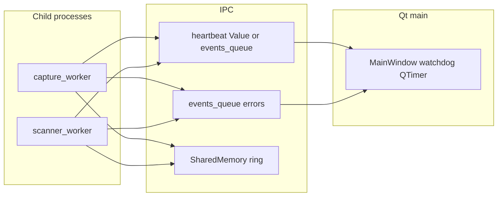

# Warehouse Reliability Hardening Implementation Plan

> **For agentic workers:** REQUIRED SUB-SKILL: Use superpowers:subagent-driven-development (recommended) or superpowers:executing-plans to implement this plan task-by-task. Steps use checkbox (`- [ ]`) syntax for tracking.

**Goal:** Tăng độ ổn định vận hành kho (Windows spawn, MP, shm, COM): watchdog worker, báo lỗi process con, dọn shm/orphan, backoff camera/COM, cooldown state machine — không phá luồng ghi hiện có.

**Architecture:** Giữ UI làm orchestrator; bổ sung **timestamp heartbeat** (multiprocessing.Value hoặc message định kỳ) từ capture/scanner; **QTimer** trên [`MainWindow`](src/packrecorder/ui/main_window.py) so sánh với thời gian thực; **Queue lỗi** chung cho worker entry (wrap try/except + traceback); **startup cleanup** shm tên theo prefix; **OrderStateMachine** có cửa sổ cooldown sau chuyển trạng thái; **capture_worker** retry read với backoff; **SerialScanWorker** reconnect có giới hạn.

**Tech Stack:** Python 3.11+, PySide6, multiprocessing (spawn), `multiprocessing.shared_memory`, OpenCV, pyserial, pytest. **Mở rộng (Task 10):** `hid` / hidapi (optional extra trong `pyproject.toml`).

---

## Chiến lược “Scale” — HID POS (USB HID-Barcode) thay vì chỉ Virtual COM

Trong triển khai SaaS/POS, người ta giảm cấu hình thủ công (COM nhảy, driver serial) bằng **chế độ máy quét HID POS**: Windows nhận thiết bị như HID, không phụ thuộc số cổng COM.

| Tiêu chí | Virtual COM (hiện tại) | HID POS (bổ sung Task 10) |
|----------|-------------------------|----------------------------|
| Cấu hình người dùng | Chọn COM hoặc VID/PID → map cổng | Chỉ cần **VID + PID** (và tùy model: report format) |
| Ổn định cổng | COM có thể đổi sau reboot | Không có khái niệm COM |
| Kỹ thuật | `pyserial` + `SerialScanWorker` | Thư viện **hidapi** (Python: gói `hid`), đọc **HID report** theo thiết bị |

**Lưu ý kỹ thuật (không được đơn giản hóa sai):**

- Dữ liệu qua HID là **report nhị phân**; format (độ dài, prefix, ký tự ASCII trong byte) **phụ thuộc firmware** từng hãng/chế độ POS. Task 10 phải có **lớp giải mã report** (ít nhất: một profile mặc định + hook mở rộng), không chỉ `decode('utf-8')` cả buffer.
- Một số máy ở chế HID vẫn **mô phỏng bàn phím** — đó là wedge, không phải HID POS “raw”; phân biệt trong tài liệu vận hành.
- **Windows:** quyền truy cập HID có thể cần driver/vendor; cần thử trên máy thật trước khi bật mặc định cho mọi khách.

**Cách gắn vào kiến trúc hiện tại:** Thêm `scanner_input_kind: "com" | "hid_pos"` (hoặc tương đương) trong `StationConfig`. Khi `hid_pos`, `MainWindow` khởi worker mới (ví dụ `HidPosScanWorker(QThread)`) với cùng signal **`line_decoded(str station_id, str text)`** như [`SerialScanWorker`](src/packrecorder/serial_scan_worker.py) để tái sử dụng `_on_serial_decoded`. COM và HID POS **không** bật đồng thời trên cùng một quầy.

---

## File map (tạo / sửa)

| File                                                                                  | Trách nhiệm                                                                                                                                                    |
| ------------------------------------------------------------------------------------- | -------------------------------------------------------------------------------------------------------------------------------------------------------------- |
| [`src/packrecorder/order_state.py`](src/packrecorder/order_state.py)                  | Cooldown sau start/stop recording (monotonic).                                                                                                                 |
| [`src/packrecorder/ui/main_window.py`](src/packrecorder/ui/main_window.py)            | Gọi SM với `now_mono`; watchdog timer; pump error queue; tích hợp cooldown config.                                                                             |
| [`src/packrecorder/config.py`](src/packrecorder/config.py)                            | `order_transition_cooldown_s`, `worker_stale_seconds`, `capture_read_retry_max` (hoặc env-only).                                                               |
| [`src/packrecorder/ipc/pipeline.py`](src/packrecorder/ipc/pipeline.py)                | Truyền Value heartbeat; `pump_events` nhận `worker_error`; `stop()` đảm bảo kill.                                                                              |
| [`src/packrecorder/ipc/capture_worker.py`](src/packrecorder/ipc/capture_worker.py)    | Heartbeat mỗi vòng read OK; try/except → `events_queue`; backoff khi `read` False.                                                                             |
| [`src/packrecorder/ipc/scanner_worker.py`](src/packrecorder/ipc/scanner_worker.py)    | Heartbeat + traceback → queue; chỉ decode slot **mới nhất** (hoặc seq tối thiểu) để giảm ghosting.                                                             |
| [`src/packrecorder/ipc/frame_ring.py`](src/packrecorder/ipc/frame_ring.py) (tuỳ chọn) | Helper đọc metadata seq/slot nếu cần mở rộng layout.                                                                                                           |
| [`src/packrecorder/app.py`](src/packrecorder/app.py)                                  | `atexit`/`signal` (Windows): gọi `MainWindow._shutdown_application` nếu có; hoặc module `cleanup_child_processes`.                                             |
| [`src/packrecorder/shm_cleanup.py`](src/packrecorder/shm_cleanup.py) (mới)            | Quét `shared_memory.SharedMemory` list names prefix `packrecorder` / pattern hiện có — **chỉ unlink** sau khi xác nhận naming convention từ `create_ring_shm`. |
| [`src/packrecorder/serial_scan_worker.py`](src/packrecorder/serial_scan_worker.py)    | Vòng reconnect COM (sleep + reopen) khi `SerialException`.                                                                                                     |
| [`src/packrecorder/hid_pos_scan_worker.py`](src/packrecorder/hid_pos_scan_worker.py) (mới, Task 10) | QThread đọc `hid.device` theo VID/PID; parse report → chuỗi; emit giống serial. |
| [`src/packrecorder/hid_report_parse.py`](src/packrecorder/hid_report_parse.py) (mới) | Hàm thuần: `bytes` report → `str` (profile Honeywell/Zebra/… từng bước). |
| Tests                                                                                 | `tests/test_order_state.py` (mới hoặc mở rộng), `tests/test_capture_worker_retry.py` (mock), `tests/test_shm_cleanup.py` (mock).                               |



---

### Task 1: OrderStateMachine — cooldown chống race (COM/camera double-fire)

**Files:**

- Modify: [`src/packrecorder/order_state.py`](src/packrecorder/order_state.py)
- Modify: [`src/packrecorder/config.py`](src/packrecorder/config.py) — field `order_transition_cooldown_s: float = 0.0` (0 = tắt, mặc định 0 để không đổi hành vi cũ; test bật 1.5)
- Modify: [`src/packrecorder/ui/main_window.py`](src/packrecorder/ui/main_window.py) — truyền cooldown vào `OrderStateMachine` hoặc kiểm tra trước `on_scan`
- Create: [`tests/test_order_state_cooldown.py`](tests/test_order_state_cooldown.py)

- [ ] **Step 1: Viết test fail — hai lần `on_scan` cùng mã trong cooldown phải trả `ScanResult()` rỗng (không stop/start)**

```python
# tests/test_order_state_cooldown.py
import time
from packrecorder.order_state import OrderStateMachine

def test_cooldown_ignores_second_scan():
    sm = OrderStateMachine()
    sm._transition_cooldown_s = 1.0  # hoặc ctor
    t0 = 1000.0
    r1 = sm.on_scan("A", is_shutdown_countdown=False, same_scan_stops_recording=True, now_mono=t0)
    assert r1.should_start_recording
    r2 = sm.on_scan("A", is_shutdown_countdown=False, same_scan_stops_recording=True, now_mono=t0 + 0.1)
    assert not r2.should_stop_recording and not r2.should_start_recording
```

- [ ] **Step 2: Chạy pytest — expect FAIL**  
      Run: `pytest tests/test_order_state_cooldown.py -v`  
      Expected: fail (chưa có cooldown)

- [ ] **Step 3: Implement — thêm `_last_transition_mono`, sau mỗi lần trả về start/stop, set cooldown; đầu `on_scan` nếu `now_mono - _last_transition_mono < cooldown` return `ScanResult()`**

- [ ] **Step 4: pytest PASS**

- [ ] **Step 5: Commit**  
      `git add src/packrecorder/order_state.py tests/test_order_state_cooldown.py && git commit -m "feat(order): optional transition cooldown"`

---

### Task 2: Heartbeat capture/scanner + MainWindow watchdog

**Files:**

- Modify: [`src/packrecorder/ipc/pipeline.py`](src/packrecorder/ipc/pipeline.py) — tạo `mp.Value('d', 0.0)` heartbeat capture (và scanner nếu tách), truyền vào `mp_capture_worker_entry` / `mp_scanner_worker_entry`; worker ghi `time.time()` mỗi frame decode/read thành công
- Modify: [`src/packrecorder/ipc/capture_worker.py`](src/packrecorder/ipc/capture_worker.py)
- Modify: [`src/packrecorder/ipc/scanner_worker.py`](src/packrecorder/ipc/scanner_worker.py)
- Modify: [`src/packrecorder/ui/main_window.py`](src/packrecorder/ui/main_window.py) — `QTimer` 2–3s: nếu `time.time() - hb > stale` → `log_session_error` + `pl.stop(); _restart_scan_workers()` (chống loop: cooldown restart 30s)

- [ ] **Step 1: Test đơn vị mock** — mock Value, hàm `is_stale(hb, now, threshold)` trong module nhỏ [`src/packrecorder/ipc/health.py`](src/packrecorder/ipc/health.py) (mới) — dễ test không cần Qt

- [ ] **Step 2: Wire pipeline** — chỉnh signature `mp_capture_worker_entry` (picklable args)

- [ ] **Step 3: MainWindow timer** — một dòng status đỏ khi stale (optional QLabel hoặc `statusBar`)

- [ ] **Step 4: `pytest tests/test_ipc_health.py` + full suite**

- [ ] **Step 5: Commit**

---

### Task 3: Exception từ worker → `events_queue` + hiển thị UI

**Files:**

- Modify: [`src/packrecorder/ipc/capture_worker.py`](src/packrecorder/ipc/capture_worker.py) — bọc toàn thân hàm `try/except Exception`: `events_queue.put(("worker_error", camera_index, traceback.format_exc()))`
- Modify: [`src/packrecorder/ipc/scanner_worker.py`](src/packrecorder/ipc/scanner_worker.py) — tương tự
- Modify: [`src/packrecorder/ipc/pipeline.py`](src/packrecorder/ipc/pipeline.py) — `pump_events` forward `worker_error`
- Modify: [`src/packrecorder/ui/main_window.py`](src/packrecorder/ui/main_window.py) — xử lý `worker_error`: `append_session_log("ERROR", ...)` + `statusBar` 30s

- [ ] **Step 1: Test** — mock queue, gọi hành vi nhỏ extract từ worker (hoặc test integration nhẹ)

- [ ] **Step 2–4: Implement + pytest + commit**

---

### Task 4: Giảm ghosting barcode — scanner chỉ decode latest slot / seq

**Files:**

- Modify: [`src/packrecorder/ipc/scanner_worker.py`](src/packrecorder/ipc/scanner_worker.py) — trước khi pyzbar, đọc `latest_seq`/`latest_slot` (cần truyền thêm `latest_seq`, `latest_lock` vào scanner như capture — **đối chiếu** chữ ký hiện tại trong [`pipeline.py`](src/packrecorder/ipc/pipeline.py))

- [ ] **Step 1: Đọc toàn bộ vòng lặp scanner hiện tại; thiết kế “chỉ decode khi seq tăng”**

- [ ] **Step 2: Test đơn vị** với numpy giả lập 2 slot (không cần multiprocessing)

- [ ] **Step 3: Commit**

---

### Task 5: Startup cleanup SharedMemory orphan

**Files:**

- Create: [`src/packrecorder/shm_cleanup.py`](src/packrecorder/shm_cleanup.py)
- Modify: [`src/packrecorder/app.py`](src/packrecorder/app.py) — gọi cleanup **trước** `MainWindow()` (chỉ Windows nếu cần)

- [ ] **Step 1: Xác định prefix tên shm thực tế từ `create_ring_shm`** (Python 3.11 tạo tên ngẫu nhiên — có thể cần đặt `name=` cố định prefix `packrecorder_` trong [`frame_ring.create_ring_shm`](src/packrecorder/ipc/frame_ring.py) — **breaking** nên làm trong cùng task + migration: chỉ đổi khi tạo mới)

- [ ] **Step 2: Hàm `cleanup_stale_packrecorder_shm()`** — trên Windows dùng cơ chế đặt tên shm có prefix (sau Task 5 Step 1); chỉ `unlink` tên do app tạo; không quét mù danh sách toàn hệ thống nếu API không hỗ trợ an toàn

- [ ] **Step 3: Test mock**

- [ ] **Step 4: Commit**

---

### Task 6: Zombie / exit — `atexit` + shutdown pipeline

**Files:**

- Modify: [`src/packrecorder/app.py`](src/packrecorder/app.py)
- Modify: [`src/packrecorder/ui/main_window.py`](src/packrecorder/ui/main_window.py) — expose static hoặc singleton weak ref để `atexit` gọi `_cleanup_workers` nếu process sống

- [ ] **Step 1: Đăng ký `atexit.register` gọi hàm an toàn (try/except) gọi `MainWindow._shutdown_application` nếu cửa sổ tồn tại**

- [ ] **Step 2: Manual test:** kill process tree / X — quan sát không còn `python` child (Task Manager)

- [ ] **Step 3: Commit**

---

### Task 7: Camera read backoff (capture_worker)

**Files:**

- Modify: [`src/packrecorder/ipc/capture_worker.py`](src/packrecorder/ipc/capture_worker.py)

- [ ] **Step 1: Hằng số `MAX_READ_FAIL`, backoff 1,2,4,8,16s cap**

- [ ] **Step 2: Sau N lần fail → `events_queue.put(("capture_failed", ...))` như hiện tại**

- [ ] **Step 3: Test logic backoff (pure function)**

- [ ] **Step 4: Commit**

---

### Task 8: COM reconnect (SerialScanWorker)

**Files:**

- Modify: [`src/packrecorder/serial_scan_worker.py`](src/packrecorder/serial_scan_worker.py)

- [ ] **Step 1: Trên `SerialException` trong reader loop: đóng port, sleep backoff, thử mở lại cùng `port` (tối đa M lần liên tiếp)**

- [ ] **Step 2: `failed.emit` chỉ khi hết retry**

- [ ] **Step 3: Test với mock serial**

- [ ] **Step 4: Commit**

---

### Task 9: Cập nhật tài liệu kiến trúc

**Files:**

- Modify: [`docs/architecture-and-flow.md`](docs/architecture-and-flow.md) — thêm mục “Độ tin cậy kho / watchdog / cooldown”

- [ ] **Step 1: PR nhỏ chỉ docs**

---

### Task 10 (nhánh tùy chọn): HID POS — đọc máy quét qua hidapi (VID/PID), không COM

**Mục tiêu:** Giảm cấu hình tay tại kho: sau khi máy quét bật chế độ HID POS, app chỉ cần VID/PID (đã có trong config từ auto-detect hoặc nhập một lần).

**Files:**

- Create: [`src/packrecorder/hid_report_parse.py`](src/packrecorder/hid_report_parse.py) — `parse_hid_barcode_report(data: bytes, profile: str) -> str`
- Create: [`src/packrecorder/hid_pos_scan_worker.py`](src/packrecorder/hid_pos_scan_worker.py) — `HidPosScanWorker(QThread)` với `line_decoded = Signal(str, str)`, `failed = Signal(str, str)` (cùng chữ ký [`SerialScanWorker`](src/packrecorder/serial_scan_worker.py))
- Modify: [`src/packrecorder/config.py`](src/packrecorder/config.py) — `scanner_input_kind: Literal["com", "hid_pos"]` per station (mặc định `"com"`); khi `hid_pos` bỏ qua `scanner_serial_port` cho worker serial
- Modify: [`src/packrecorder/ui/dual_station_widget.py`](src/packrecorder/ui/dual_station_widget.py) — radio hoặc combo: COM vs HID POS; ẩn combo COM khi HID POS
- Modify: [`src/packrecorder/ui/main_window.py`](src/packrecorder/ui/main_window.py) — trong `_restart_scan_workers`, nhánh `hid_pos`: mở `HidPosScanWorker` thay `SerialScanWorker`
- Modify: [`pyproject.toml`](pyproject.toml) — optional dependency `[project.optional-dependencies] hid = ["hid>=X"]` (phiên bản cố định sau khi kiểm tra wheel Windows)

- [ ] **Step 1: Viết test thuần cho parser — không cần thiết bị**

```python
# tests/test_hid_report_parse.py
from packrecorder.hid_report_parse import parse_hid_barcode_report

def test_default_profile_ascii_payload():
    # Ví dụ: 8 byte payload ASCII sau 1 byte report ID giả định — điều chỉnh theo profile thật khi có spec thiết bị
    raw = bytes([0x01]) + b"ABC123\x00"
    assert parse_hid_barcode_report(raw, profile="ascii_suffix_null") == "ABC123"
```

- [ ] **Step 2: Chạy pytest — FAIL** (chưa có module)

- [ ] **Step 3: Implement `hid_report_parse.py` tối thiểu một profile + raise rõ nếu `hid` chưa cài**

- [ ] **Step 4: Implement worker mở `hid.device(vid, pid)` trong thread, loop read, gọi parser, emit (debounce giống serial nếu cần)**

- [ ] **Step 5: Wire MainWindow + config + UI; test không có HID: import skip hoặc mock `hid.device`**

- [ ] **Step 6: Commit**  
  `git add src/packrecorder/hid_*.py src/packrecorder/config.py ... && git commit -m "feat(scanner): optional HID POS input via hidapi"`

**Ràng buộc:** Không truyền QObject vào `Process`; worker HID chạy **QThread trong process chính** (giống serial), không spawn process mới trừ khi sau này tách vì lý do riêng.

---

## Self-review (checklist nội bộ)

| Yêu cầu gốc           | Task                                                                           |
| --------------------- | ------------------------------------------------------------------------------ |
| Zombie process        | Task 6 + đảm bảo `MpCameraPipeline.stop` luôn gọi khi restart (đã có)          |
| Ghosting shm          | Task 4                                                                         |
| FFmpeg UI block       | Đã có encode writer; plan không đổi trừ khi đo được block — ghi chú trong docs |
| Race state machine    | Task 1                                                                         |
| Watchdog              | Task 2                                                                         |
| Exception child → UI  | Task 3                                                                         |
| SHM leak              | Task 5                                                                         |
| Camera/COM disconnect | Task 7, 8                                                                      |
| Picklable args        | Task 2–3: chỉ Value, str, int, Queue — không Qt objects                        |
| Giảm cấu hình COM (scale POS) | Task 10 — HID POS + VID/PID; không thay Task 8 (COM vẫn cần cho khách cũ) |

**Placeholder scan:** Không dùng TBD; Task 5 cần xác nhận tên shm thực tế trong code trước khi unlink hàng loạt; Task 10 cần **mẫu report thật** từ 1–2 model máy quét mục tiêu để không đoán parser.

---

## Lưu ý triển khai

- Đổi chữ ký `mp_capture_worker_entry` ảnh hưởng mọi chỗ `Process(...)` — cập nhật một lần trong [`pipeline.py`](src/packrecorder/ipc/pipeline.py).
- Tránh restart vòng lặp vô hạn: mỗi camera tối đa 1 restart / 30s hoặc exponential cap.

---

## Execution handoff

**Plan đã cập nhật** (file: `c:\Users\nhanl\.cursor\plans\warehouse-reliability-hardening_ad5df395.plan.md`). Bản đồng bộ repo: [`docs/superpowers/plans/2026-04-08-warehouse-reliability-hardening.md`](docs/superpowers/plans/2026-04-08-warehouse-reliability-hardening.md).

Hai hướng thực thi:

1. **Subagent-Driven (khuyến nghị)** — một subagent mỗi task, review giữa các task.
2. **Inline Execution** — làm tuần tự trong cùng phiên, có checkpoint.

Bạn muốn bắt đầu từ Task 1–9 (ổn định worker/shm/state) rồi Task 10 (HID POS), hay ưu tiên Task 10 trước?
